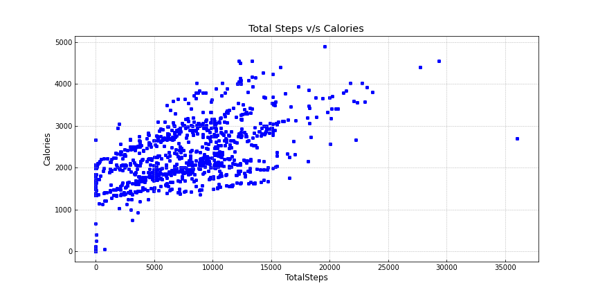
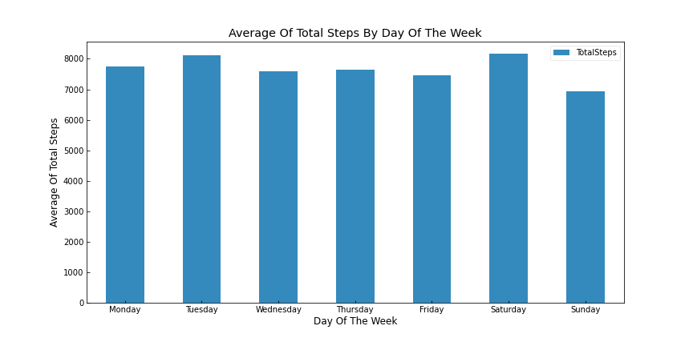
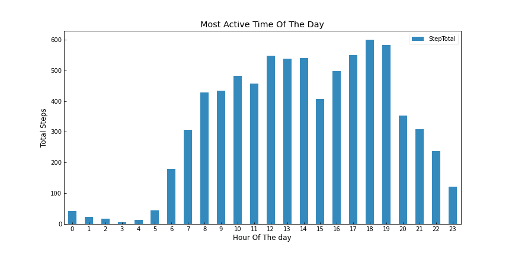

# BellaBeat

<i>How can a wellness technology company play it smart?</i>

## ABOUT THE COMPANY

Bellabeat is a high-tech company that manufactures health-focused smart products. Founded in 2013 by artist Urška Sršen and mathematician Sando Mur, the company has many products carefully designed to monitor activity, stress, sleep, and reproductive data to help women better understand how their bodies work and make healthier choices. While small in size, Bellabeat has quickly positioned itself as a tech-driven wellness company for women. Chief Creative Officer, Urška Sršen, believes that analyzing smart device fitness data could help unlock new growth opportunities for the company.

## BUSINESS TASK

Focus on one of Bellabeat’s products and analyze smart device data to gain insight into how consumers use non-Bellabeat smart devices.

## PRODUCT

<li><b>BellaBeat App : </b>The Bellabeat app provides users with health data related to their activity, sleep, stress, menstrual cycle, and mindfulness habits. This data can help users better understand their current habits and make healthy decisions. The Bellabeat app connects to their line of smart wellness products.</li>

## STAKEHOLDERS

<li><b>Urška Sršen –</b> Bellabeat’s cofounder and Chief Creative Officer.</li>

<li><b>Sando Mur –</b> Mathematician and Bellabeat’s cofounder; key member of the Bellabeat executive team.</li>

<li><b>Bellabeat Marketing Analytics Team –</b> A team of data analysts responsible for collecting, analyzing, and reporting data that helps guide Bellabeat’s marketing strategy.</li>

## ASK

<li>What are some trends in smart device usage?</li>

<li>How could these trends apply to Bellabeat customers?</li>

<li>How could these trends help influence Bellabeat marketing strategy?</li>

## PREPARE
<b>Urška Sršen</b> encourages the use of public data that explores smart device users’ daily habits. Therefore, the dataset used in this project will be the FitBit Fitness Tracker Data (CC0: Public Domain, dataset made available through [Möbius](https://www.kaggle.com/arashnic).

### About the data

According to its source, the dataset was generated by respondents to a distributed survey via Amazon Mechanical Turk and comprehends dates between 03-12-2016 and 05-12-2016. Thirty FitBit users consented to the submission of their personal tracker data – which includes a minute-level output for physical activity, heart rate, and sleep monitoring. Variation between output represents the use of different types of Fitbit trackers and individual tracking behaviors/preferences.

This public dataset is comprised of 18 CSV files – each containing specific tracking information, such as daily calories, daily steps, etc. The data is organized in the long format, where an Id column identifies each user, and the remaining columns contain different attributes about the said user.

In regard to data bias, considering that the dataset only gathers information of 33 FitBit users over the span of two months, it is important to keep in mind that there is a real possibility that the data isn’t a perfect representation of all FitBit users. However, we can still analyze the dataset and learn interesting information about the surveyed users and how they used their smart tracking devices over that time period.

## PROCESS

## ANALYZE 
### Key Findings

<li>The average users take 7,638 steps and burns 2,304 calories per day.</li>

<li>There is positive relationship between the total number of steps and the total number of burned calories.</li>

<li>The users seem to be consistent with their total steps scores throughout the week. The most active day is Saturday, and the least active day is Sunday.</li>

<li>The users start their day between 6 a.m. and 8 a.m. They're most active between 5 p.m. and 7 p.m. and become least active at 8 p.m. and after.</li>

<li>The highest number of burned calories occur between 5 p.m. and 7 p.m., when the users are most active.</li>

<li>Although the average user is very active for over 30 minutes every day, they still spend 81% of their time being sedentary.</li>

<li>There is strong, positive relationship between the total number of minutes asleep and the total time spent in bed, with users only spending an average of 39.5 minutes of their total time in bed being awake.</li>

<li>The users have a consistent sleeping schedule, with an average sleeping time of 419.8 minutes(or 7 hours) per night with Sunday(7.6 hours) being the day where the users seem to have slept the most.</li>

<li>Recording the lowest number of steps and the highest number of minutes asleep, Sunday is likely a rest dat chosen by the users.</li>

## SHARE
#### Visualizing Total Steps v/s Calories Burned

As we can see on the scatter plot above, there is <b>positive relationship between the two variables</b>, which indicates that <b>the greater the number of steps taken, the more calories the user burns</b>. As discovered earlier, keeping active is crucial for maintaining good health, and the number of steps the individual takes daily has a significant impact on that.

#### Visualizing Average Total Steps by Day of The Week

The above bar chart shows us the average total steps taken by the users throughout the week. The <b>most active day in terms of steps taken is Saturday, followed by Tuesday</b>. The <b>least active day is Sunday</b> - most likely a rest day for the users. It also gives us the confirmation that the users seem to be consistent with their total steps scores.

  
#### Visualizing The Most Active Time of The Day

The above bar chart shows us that the <b>users tend to be more active between 6 and 8 am</b>. The level of activity stays doesn't change dramatically throughout the day, but the <b>peak hours seem to occur between 5 and 7 pm</b>. Our users are likely choosing to work out after work/school/college hours. Although take a note that their <b>level of activity starts decreasing significantly at 8 pm and keeps going down as the hours progress</b>, likely users seem to go to bed at a reasonable time, as lower levels of activity are recorded at late hours of the night.

#### Visualizing The Time of The Day Users Burn The Most Calories

According to the [SleepFoundation](https://www.sleepfoundation.org/how-sleep-works/how-your-body-uses-calories-while-you-sleep), we burn around 50 calories an hour while we sleep - and we are able to see that in the graph above. Observe that as the users wake up and start moving, the number of burned calories increases, peaking around the same time that the users are most active during the day.

## ACT

Recommendations based on key trends observed in our data to help guide Bellabeat's marketing strategy:

> 
<b>Personalized notifications to promote activity :</b> The users on average take total steps of 7,638 well below the mark of 10K daily steps recommended by the CDC. In addition, above analysis reveals that users spend about 81% os hteir day being sedentary. Bellabeat could incorporate personalized notifications on its app to motivate users to keep moving throughout the day, which could include real-time information regarding total number of steps taken so far or even number of steps left in order to reach the daily steps goal.

> 
<b>Dynamic Calories Counter :</b> The app could also provide the user with an easy to use interface that displays the number of calories that are being burned throughout the day to improve motivation, the users could also have the option to set customized daily calories goal and be able to follow their progress throughout the day.

> 
<b>Detailed Sleep Log :</b> The average user has a consistent sleeping schedule, but those who may want to improve the quality of their sleep or simply keep a track of it could benefit from a sleeping log. The app could also offer this feature and record sleep quality, the number of times one wakes up during the night, the total amount of time being awake in the bed, anxiety, and/or stress levels.

> 
<b>Weekly or Monthly Achievement Reports :</b> To keep users motivated for long term, the Bellabeat app could provide customized weekly and monhtly reports regarding the total num of steps, burned calories, sleeping habits, weight loss, and total time spent on different levels of activity. The app could send customized congragulatory message/notification to those who keep up with good habits as well as motivational tips for improvement depending on the users overall performance.

> 
<b>Meditation, Relaxation and Workout Video Services :</b> The app could also offer meditation and relaxation tips services either for free or premium basis to those who are looking to improve their sleep quality and/or reduce stress and anxiety levels by tracking the time of the day when their activity decreases, their rest days, or perhaps around bedtime, the app could send notifications to the persons phone or smart device and suggest different relaxation or meditation techniques. And for those looking for motivation and mostly sedentary the app could suggest some exercises in form of notifications with pictures or videos to be active and improve their health by tracking their total steps taken, calories burned and the activity level.

> 
<b>Discounts on other Bellabeat wellness products and services :</b> Another way to keep customers motivated is to offer special discounts on different Bellabeat products, as well as their premium memberships. This way, the users could become more inclined to get more active and purchase more products from the company.

